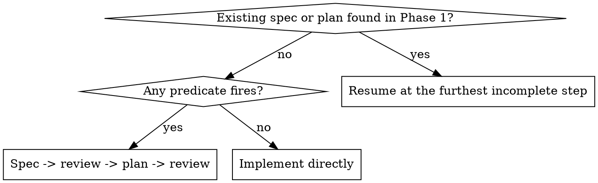
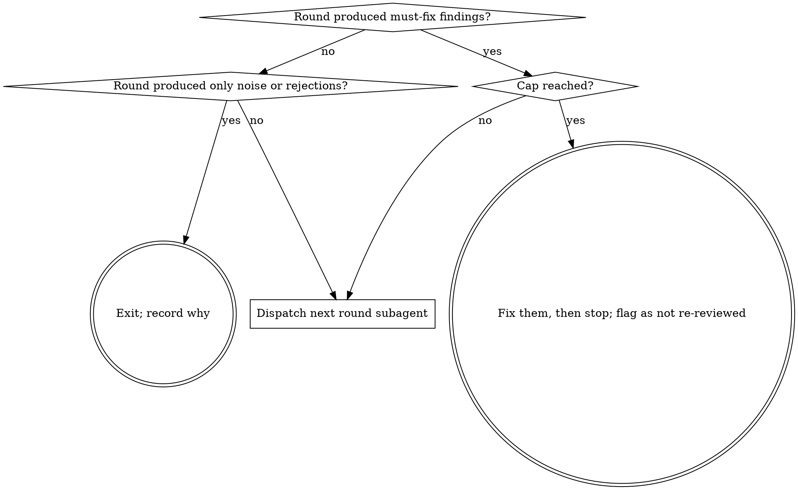

# Implement Ticket

Take a ticket from its tracker to a draft PR, with fresh-context subagents doing the work phase by phase, and fresh-context reviewers as the quality gate.

**Core principle:** you do not stop reviewing when you are satisfied. You stop when a review round stops earning its cost — measured, and recorded.

**Flags:** `--spec` / `--no-spec` force the size gate either way. `--max-rounds N` raises the review cap from 3 to at most 5.

**REQUIRED SUB-SKILLS:** superpowers:requesting-code-review (dispatching reviewers), superpowers:receiving-code-review (triaging what they return), superpowers:test-driven-development (implementation), superpowers:verification-before-completion (before any green claim).

## Orchestration model

You start as the **orchestrator**. From here on, you never read a ticket, run a build, edit code, or triage a finding yourself — you dispatch one fresh subagent per phase (Agent tool, `subagent_type: "general-purpose"`, never a fork: a fork inherits your context, and the entire point here is that these subagents must not) and act only on what it reports back. Each phase below states **Dispatched as:** who runs it, and ends with **Returns to the orchestrator:** — the entire report you read. Do not ask a subagent to narrate its work; ask it to fill that shape, and read only the shape.

**Dispatch prompts are short.** Name the ticket, the repo, which phase to run ("Run Phase 2 of implement-ticket"), and whatever state already exists — `worktree_path`, `notes_path`, the PR number, a human's answer to an earlier question. The subagent loads this same skill itself and executes that phase's instructions; you are not restating them.

**State that must outlive one subagent lives on disk, never in your context.** The acceptance checklist and verify legs go in the notes file (Phase 2); round-by-round review history goes in the rolling PR comment (Phase 5) — exactly as this skill already required before reviewer subagents existed. Extend the same discipline to the boundary between you and whichever subagent runs next: it re-derives what it needs from the notes file, the PR and the diff, not from being told your history.

**A subagent cannot talk to the human — you can.** Wherever an instruction below says "ask" or "stop and ask," a dispatched subagent instead returns the question (`open_questions`, `blocked`, or a named flag) and stops short of deciding it. You read that field, ask the human, and fold the answer into the next dispatch. Phase 3 (the size gate) is the one phase that runs in your own context — every other phase is a subagent.

**You hold, across the whole run:** the ticket id, `worktree_path`, `notes_path`, the PR number once one exists, and the round counter against the cap. Nothing else needs to survive from one dispatch to the next.

**Track the run with a task list.** Before dispatching Phase 1, create one (`TaskCreate`) with these entries, named exactly as below — short mnemonics, not the phase headings verbatim, and no `Phase N —` prefix or number, since a dispatch instruction already names the phase and the list's own order carries the sequence:

- Intake
- Recon
- Size gate
- Spec & plan
- Implementation
- Land

Mark each in-progress right before its dispatch and completed when that subagent's report comes back — this is the record of where the run stands once the work itself is happening inside subagents you cannot narrate over. Drop "Spec & plan" once Phase 3 takes the short path; there is nothing to track for it.

**The review loop (5b) gets one task per round, added as each round is dispatched rather than upfront** — the round count is not known until the loop actually exits. Insert `Review round N` before `Land`, mark it in-progress on dispatch and completed once that round's triage and fixes land. Stop adding rounds once the loop exits on its own terms (a round earns nothing, or the cap is hit); the list then shows exactly how many rounds this run took.

## Phase 1 — Intake

**Dispatched as:** one subagent, given the ticket id/URL and the repo.

**The tracker is pluggable, and it is not the code host.** This skill needs exactly six things from wherever tickets live:

1. the ticket's id, title and body
2. its comments, in order, oldest to newest
3. its assignee, status, and — where the tracker has them — its team and sprint
4. the ability to set the status and the assignee
5. somewhere to post and later update one comment, as a fallback for when there is no PR
6. links to related tickets, where the tracker has them

GitHub satisfies these through `gh` — the commands below — except status, which it has no native notion of: on GitHub that lives on a Project board's status field, or on a label. **For Jira, Linear or anything else, use whatever skill or MCP server is installed for it** and get the same six things through it. If a teammate has no tracker access at all, ask for the ticket text to be pasted, and say plainly in the report that the rolling comment went to the pull request only, because nothing could reach the ticket.

The **code host** is a separate question. Branches, pull requests and CI go to whatever forge the repo pushes to (`gh`, `glab`, …). A team tracking work in Jira and hosting code on GitHub uses one for the ticket half and the other for the PR half, and neither substitutes for the other.

**Find the prior work before you scope anything.** Someone may already own this — a parallel job, an earlier session, a merged stage from last week. Search in both directions: work titled for the ticket, work its comments name, and the issues earlier stages *filed*.

```bash
git worktree list                                # the reliable local detector
git branch -a --list '*<n>*'                     # catches unpushed branches
gh pr list --search 'in:title <n>' --state all   # merged stages too, not just open
gh issue view <n> --json comments                # stage comments usually name their PR
```

If anything turns up — a reviewed spec, a merged stage, an open PR, an abandoned branch — **read `references/resuming-partial-work.md` before scoping**. Resume from the furthest completed work rather than repeating it: a spec already written and reviewed is Phase 4 you do not redo. Computing the remaining work, choosing between continuing a branch and stacking a new one on it, and picking the diff range each have traps that cost a rebuilt stage or three re-litigated review rounds.

Note out loud which stage this run implements, and stop at its boundary — this becomes `resume` in the report.

**Look for siblings in flight, not just prior work on this ticket.** Several tickets running at once is the normal case, and they collide through *files*, not through ticket numbers — sibling issues split from one parent almost always land in the same code.

```bash
gh pr list --state open --json number,headRefName,files   # what else is being edited right now
git worktree list                                          # including work not yet pushed
```

Once you know the files this change will touch, name every open PR that touches them too. Then:

- **Do not coordinate, rebase onto, or wait for them.** Merge order is the human's call, and a branch that chases a sibling that has not landed is worse off than one that does not.
- **Note it for the PR body** — which PRs overlap, on which files, and which you think should land first. Whoever lands second rebases; that is cheap when expected and expensive when discovered.
- **Watch for the same finding arriving twice.** Two reviewers on two tickets will both report a defect in shared code. Fix it in whichever PR owns that code and say so in the other, rather than fixing it in both and conflicting.

**One machine, many jobs.** Parallel runs share memory, CPU and disk. Prefer one target framework per review round and the full matrix once before the PR, and remember that a test failing only under load is a symptom of the load — see the flake rule in Phase 5.

**Read the ticket, then read its comments.**

```bash
gh issue view <n> --json title,body,comments
```

- **Later comments supersede the body — and each other.** They do not merely add scope; they routinely falsify a claim the body makes, and a comment reporting one is itself sometimes corrected by the next. The last word on a point wins, and a superseded claim must not reappear in the spec, commit message or PR body.
- **Empty output with exit 0 is a failure, not an empty ticket.** `gh` can return nothing under a sandbox while reporting success. Retry unsandboxed before believing it.

**Build the acceptance-criteria checklist from the whole ticket** — body, every section, and the comments. A heading named "Acceptance" is a starting point, not the boundary; hard requirements hide in "Scope", in prose, and in comments that postdate both.

**Check the siblings the ticket references.** Distinguish three cases, because they need different handling: an issue whose behaviour is adjacent (do not build it), an issue that must be *decided together* with this one but shipped separately (raise it now), and an issue this one absorbs (build it).

**Claim the ticket before starting work on it.** Two writes, both idempotent, so a teammate looking at the board can see the work is under way:

- **Move it to In Progress.** On Jira, transition it through the installed Jira skill or MCP. On GitHub there is no native status — it lives on a Project board's status field where the repo uses one, and otherwise as a label; check which before inventing one.
- **Assign it to the developer running this.** Resolve who that is from the tracker's own account, not from a guess.

**A ticket assigned to someone else is a full stop.** Do not claim it, and do not start work on it. Return `blocked` with who holds it and what state it is in — that is a question about people, and guessing at it wastes someone's day or duplicates their work. The same applies when it is already In Progress under another name.

If it is already yours and already In Progress, both writes are no-ops; note it and carry on.

**Warn on a ticket that is filed wrong, and suggest — never silently fix.** These are the ones that cost a sprint if nobody notices, and on Jira they are routine:

- the ticket names a **different team** from the one whose repo you are in
- the ticket is **not in the current sprint** — backlog, a future sprint, or no sprint at all
- it has no estimate or no fix version, where the project requires one

Return each in `warnings` with what it currently says and what it probably should say, and let the human make the change through the orchestrator. A ticket quietly moved into the active sprint by a tool is a planning decision nobody agreed to.

**Stop and ask — this rule applies from here on, not only on the long path.** If the ticket leaves a question whose answers lead to materially different work — a product decision, or an ambiguity the ticket cannot settle — return it in `open_questions` rather than guessing. Do not guess at the shape of work that depends on the answer.

**Returns to the orchestrator:**

- `ticket`: id, title, one-line summary
- `acceptance_checklist`: the full checklist built from body + comments
- `resume`: `none` | `{from: spec|plan|branch|pr, details}` — what was found and where to pick up
- `siblings`: open PRs touching the same files, and what to say about them in the PR body
- `warnings`: filed-wrong-team | wrong-sprint | no-estimate — non-blocking, reported not fixed
- `open_questions`: product decisions the ticket can't settle — non-empty means the orchestrator stops before Phase 2
- `blocked`: `null` | `{reason: assigned-elsewhere|already-in-progress-elsewhere, holder, state}` — non-null means full stop
- `claimed`: true | false — false only if blocked

If `blocked` or `open_questions` is non-empty, stop and ask the human before dispatching Phase 2.

## Phase 2 — Recon

**Dispatched as:** one subagent, given the ticket id, the repo, and Phase 1's `acceptance_checklist` and `resume` (they get written into the notes file this phase creates).

Do this before touching code, so a missing prerequisite fails in seconds rather than an hour in.

1. **Decide the base:** `git fetch origin`, then take the freshly fetched `origin/<default>`. Never a stale local branch. (The branch itself is created in step 5 — do not create one here.)
2. **Find the real verify legs, in this order:** `.github/workflows/` (or the equivalent CI config) first — for any repo with CI this is the only place the true matrix is recorded; then CLAUDE.md / AGENTS.md / CONTRIBUTING; then README; then project files (`package.json` scripts, `*.slnx`/`*.sln`, `Cargo.toml`, `pyproject.toml`, `Makefile`) as a discovery hint for *what* builds, which is not yet a command.

   Write down a **list of legs**, not one blurred command. For each: its command, whether it is intrinsic (a single invocation already covers the matrix) or a separate toolchain, and whether it is cheap enough to run every review round or belongs once before the PR.

   **Capture the flags that decide green from red.** A CI build with `-warnaserror`, `--strict`, `-Werror` or a coverage floor is a different verdict from the same build without it. A local green missing those flags is a false green.

   **A leg that cannot run locally** — needs Docker, a pinned toolchain, credentials — is named explicitly as not run, with the reason. Never let silence imply it passed.
3. **Find the release-note convention**, if the repo has one: `CHANGELOG.md`, `docs/release-notes/`, `.changeset/`, `newsfragments/`. Where one exists, an entry is part of the definition of done — read the last few entries and match their register. Cosmetic changes (a typo fix, a rename, prose edits) usually get no entry; check what the repo actually does before adding one.
4. **Confirm `gh auth status`** — the run ends in a PR unless told otherwise.
5. **Create a dedicated worktree** with a collision-proof name. Named worktrees are shared, and a parallel job will take a plain `issue-<n>` directory out from under you. Derive the branch and directory from **one** suffix so they can be matched up later:

```bash
BASE=$(git symbolic-ref --short refs/remotes/origin/HEAD)   # e.g. origin/main
SLUG=<n>-<short-slug>-$(od -An -N2 -tx1 /dev/urandom | tr -d ' ')
git worktree add -b "$SLUG" ".claude/worktrees/$SLUG" "$BASE"
```

If a wrapper intercepts `git` and fails inside worktrees, call `/usr/bin/git` directly. Your cwd may be pinned outside the worktree — use absolute paths for every file operation rather than assuming you can `cd` into it.

6. **Write the notes file where it survives past this subagent.** The acceptance checklist and the verify legs are consumed by every later phase and by reviewer subagents that cannot see any conversation. Seed it with Phase 1's `acceptance_checklist` and `resume`, and put it where the repo will never commit it:

```bash
NOTES="$(git rev-parse --absolute-git-dir)/ticket-notes.md"
```

**Returns to the orchestrator:**

- `worktree_path` (absolute), `branch`
- `verify_legs`: list, each with command, intrinsic-or-separate, cheap-or-expensive, and cannot-run-locally-and-why where that applies
- `release_note_convention`: path, or "none"
- `gh_auth`: ok | problem, with detail if a problem
- `notes_path`

You now hold `worktree_path` and `notes_path` for the rest of the run. Never `cd` there or edit anything there yourself — every later dispatch gets these paths and works from them directly.

## Phase 3 — Size gate

**Runs in your own context** — a decision from Phase 1's report, not a dispatch.

Escalate if **any** predicate fires:

| Predicate | Reading |
|---|---|
| Multiple independent deliverables | Separately shippable pieces, not bullet count. A one-line fix written as three bullets does not fire this. |
| New public API surface | Anything a consumer outside this repo can call, or that an export/codegen surface publishes. |
| More than one module touched | Module = a packaged or deployable unit. `src` plus its own `test` project is **one** module. |
| Config or data format change | A field is **added, removed, renamed, moved, or reshaped** (scalar becomes block, one value becomes a list), or a wire contract changes. **Not** a validation change: refusing a value that used to be accepted, or accepting one that used to be refused, leaves the format exactly as it was and is ordinary bounded work. |
| The ticket asks for a decision | It investigates, weighs options, or leaves the design open — in the title *or* the body. |



Every box past this point is a subagent dispatch (Phase 4, or the Phase 5 Implementation subagent) — you make the call here, but none of the ticket's actual content needs to stay in your context past it.

`--spec` and `--no-spec` override. When genuinely torn, escalate: a spec is cheaper than a wrong implementation.

**But check the cost against the change before you escalate.** A spec commits the ticket to three review passes — spec, plan, code. That is right for work whose *shape* is uncertain, and wrong for work that is merely careful: a validation tightened, a message corrected, a bug fixed in one function. If you cannot name a decision the spec would settle, there is nothing for it to do, and the predicate that fired was read too generously. Escalate on uncertainty about **what to build**, never on the delicacy of building it.

## Phase 4 — Long path only: spec, then plan

**Dispatched as:** two subagents in sequence, Spec then Plan — the plan needs the reviewed spec, so do not dispatch it early to save a round trip.

Follow the repo's existing convention (look for `docs/**/specs/` and `docs/**/plans/`); otherwise `docs/specs/` and `docs/plans/`. Commit each artifact to the branch.

**Spec subagent**, given `worktree_path`, `notes_path`, and the acceptance checklist:

1. Write the spec. Mark it `Draft`, with an explicit **Open Questions** section.
2. Review the spec — **one round, not the loop.** Axes: **the attack surface the design creates** (what it trusts, what it executes, what crosses a boundary), contradictions and placeholders, claims that are false about the actual code, scope, and requirements that could be read two ways.

**Returns to the orchestrator:** `spec_path`, `key_decisions` (short bullets), `open_questions` (non-empty means stop and ask before dispatching the Plan subagent).

**Plan subagent**, given `spec_path`:

3. Write the implementation plan (superpowers:writing-plans), each task naming its test first.
4. Review the plan — **one round.** Axes: does it implement the spec, is each step independently verifiable, is the ordering real.

**Returns to the orchestrator:** `plan_path`, `task_list` (short), `open_questions` (non-empty means stop and ask before dispatching Phase 5a).

Only once the plan is reviewed does Phase 5a implement and run the loop proper on the code.

**A document gets one round, not a capped loop.** Phase 5's cap exists because fixing code can introduce new defects, so a fix needs re-review. Editing a paragraph does not carry that risk, and a second round on a document mostly re-reads what the first round already read. Run one round, apply what it finds, and move on; run a second only if the first round changed the design rather than the wording.

**Three loops for one ticket is the thing to avoid.** Spec, plan and implementation each drawing a full multi-round review is how a bounded change ends up costing more in review than it did in code. If that is where a ticket is heading, the size gate was probably wrong — go back and check which predicate fired.

## Phase 5 — Implementation, then the review loop

### 5a — Implementation

**Dispatched as:** one subagent. Long path: given `plan_path`. Short path (Phase 3 said "Implement directly"): given the ticket and `acceptance_checklist` directly, no plan.

Implements via superpowers:test-driven-development, gets the cheap verify legs green locally, then **opens the draft PR.** Once the first commit builds and tests green, push the branch and `gh pr create --draft`. The review loop reports into it, so the human can watch rounds land instead of waiting for a silent hour. **It stays a draft for the whole loop** — see Phase 6 for the only conditions that take it out of draft.

```bash
PR=$(gh pr create --draft --base "${BASE#origin/}" --title "<subject> (#<n>)" --body-file "$NOTES_PR")  # prints the URL
```

If this PR is **stacked** on another branch rather than the default one, `--base` names that branch, and this must be said in the report and in the PR body — see `references/resuming-partial-work.md`. A stacked PR that reads as an ordinary one gets reviewed against the wrong base and merged in the wrong order.

**Returns to the orchestrator:**

- `pr_number`, `pr_url`
- `build_status`: green (this subagent does not hand off until it is)
- `axes_earned`: which review axes this diff's neighbourhood earns, from the table in 5b — seeds round 1

### 5b — The review loop

**Runs as:** you drive the loop; each round is its own subagent dispatch. Cap at **3 rounds** (`--max-rounds 5` to extend).



**Dispatched as:** one subagent per round, given `worktree_path`, `notes_path`, `pr_number`, the round number, and `light_or_full` (`axes_earned` for round 1; the previous round's `next_round_recommendation` after that).

**A round subagent's first step is reconstructing round history from disk, not memory.** Read the notes file and the rolling PR comment before anything else — that is the only record of what earlier rounds found, fixed, and rejected, and it is what makes thrash (a round reversing an earlier one) and whack-a-mole (the same defect class recurring) detectable without seeing prior transcripts.

Each round:

1. **Build and test first, once, and hand reviewers the result.** A red diff never goes to reviewers — and a green one does not need proving again by each of them. Put the command run and its output in the notes file every reviewer receives, and tell them the suite is green as of this commit.

   **Reviewers must not re-run the full suite.** N reviewers each running a nine-leg matrix is N-1 redundant runs of a result already in hand, and on a loaded machine it is what makes timing-sensitive tests flake and builds crawl. What reviewers *should* run is small and targeted: a throwaway probe that proves one finding, or a filtered run of the tests their finding touches. Executing code to prove a claim is the point; re-establishing a fact the loop already established is waste.
2. **Dispatch fresh reviewers in parallel** per superpowers:requesting-code-review — each gets the ticket text, the acceptance checklist, the notes path and the diff range, never any session history. Five axes, **all of them from round 1**:
   - **security** — attack vectors, injection (command, SQL, path, template), unvalidated input reaching a shell, a filesystem path, a URL or a deserializer, secrets in logs or errors, credentials sent somewhere they were not scoped for, remote code execution, escalation through a config value the attacker controls. Use the `security-review` skill if one is installed. This axis runs in **round 1** and is never dropped when narrowing later rounds — a design that is unsafe is cheapest to fix before anything is built on it.
   - correctness bugs
   - conformance to the acceptance criteria
   - simplification and reuse
   - **use the output** — for any change a human reads (an error message, CLI output, a doc, an API exception), one reviewer builds the real output on a concrete example and *follows its advice literally*, reporting what happens.

   Introducing an axis late resets the loop: rounds that should be converging start finding worse defects than the rounds before them. That is a scheduling mistake, not a discovery.

   **Choose round 1's axes by what the change touches, not by the length of this list.** Five reviewers against a one-function fix spends as much as five against a credential path, and buys far less. Cost should track what a defect would cost, which is about the code's neighbourhood rather than the diff's size — a twenty-line change to a confinement check earns the security axis; a four-hundred-line refactor of pure formatting does not.

   | Axis | Earn it with |
   |---|---|
   | security | untrusted or configured input reaching a shell, a path, a URL, a query or a deserializer; credentials; a subprocess; a network call; a sandbox or confinement rule |
   | correctness | always — this is the floor |
   | conformance | a ticket with several criteria, a staged ticket, or one whose body the comments have rewritten |
   | simplification | a diff large enough to have structure worth questioning, or one that touched code it did not need to |
   | use the output | a change to anything a human reads: an error message, CLI output, a doc, a public exception |

   One axis and one reviewer is a legitimate round 1 for a small change in a quiet corner. Say in the report which axes ran and which were not earned, so nobody reads a narrow review as a broad one.

   **Between rounds, narrow.** The rolling PR comment already carries what the previous round cleared and what it rejected, so reviewers spend their pass on the delta and on the axes still live. This raises signal and lowers cost.

   **A reviewer that stops producing output has stopped, whatever its status says.** Rounds take minutes; one still shown as "running" hours later, with an output file that has not grown, is finished in every sense that matters. Judge it by the age and size of that file rather than by its status, stop it, and either re-dispatch that axis once or record it as not run. Never let a round wait on one, and never read its silence as a clean pass on its axis.

   **Diagnose before blaming the agent.** Several reviewers stopping within seconds of each other is one external event, not several coincidences — an exhausted rate limit, a dropped network, a machine that slept. Check for the shared cause (uptime, load, the other agents' timestamps) before concluding anything about the work, because "the reviewer hung" and "the whole session lost its API" call for different responses, and only one of them is worth re-dispatching into immediately.

   **Watch the load, too.** Reviewers run builds and test suites. Enough of them at once, or alongside other jobs on the same machine, turns a 12-second build into a 12-minute one and makes timing-sensitive tests flake in code the change never touched. A flake under load is not a finding; confirm it by running that test alone before believing it.
3. **Collect the inbound comments too.** Findings do not only come from the reviewers just dispatched. Before triaging, read what has arrived since the last round on **both** the PR and the issue — automated reviewers, and humans:

   ```bash
   gh pr view "$PR" --json comments,reviews
   gh issue view <n> --json comments
   ```

   These go through the same triage as everything else. A bot is a reviewer that is confidently wrong at a higher rate, not a lower one.

   An automated reviewer may report nothing for reasons that have nothing to do with the code — a draft PR, a plan tier that does not review automatically, a rate limit, or a review that must be triggered by hand. **A passing bot check is not an approval and not a review seat.** Never block a round waiting for one, and never count its silence as a clean pass; note that it did not report and move on. If the repo has a reviewer that only runs on a manual trigger, say so in the report so the human can fire it — do not trigger it directly, since that spends someone else's quota.
4. **Triage every finding** as must-fix / worth-fixing / noise, per superpowers:receiving-code-review. Verify each claim against the code before accepting it. A wrong finding earns a written rebuttal, not a compliant edit.
5. **Fix** must-fix and agreed worth-fixing. Log rejections and their reasons in the notes file — they go in the PR body.
6. **Evaluate whether another round is worth it.** Record the decision either way, as `decision` / `decision_reason`.
7. **Update the rolling comment on the PR** — one comment, edited in place, never a new comment per round. It carries the cumulative history: for each round, the axes run, what was found, what was fixed, and what was rejected with the reason. A reader arriving at any moment sees the whole story in one place.

```bash
gh pr comment "$PR" --edit-last --create-if-none --body-file "$ROUND_SUMMARY"
```

**The rolling comment belongs on the pull request, on the code host — not on the ticket**, even when the tracker is somewhere else entirely. Review rounds are about the diff, and they are only useful beside it; a Jira ticket carrying five rounds of code-review detail is noise to everyone reading the board. The ticket gets the stage record at the end (Phase 6), not the round-by-round.

If no PR exists yet (the run was told not to open one), post the same rolling comment on the ticket instead — `gh issue comment <n> --edit-last --create-if-none` on GitHub, or the equivalent update-in-place call on whatever tracker this is. Editing one comment matters more than where it lives: a round per comment buries the ticket.

### A round can be light

A round is not all-or-nothing. When the last round's findings were narrow, the next one should be too — a full five-axis fan-out against a one-function change re-confirms axes that already went quiet, at full cost.

**Run a light round — one or two reviewers, scoped to the delta — when all of these hold:**

- every must-fix finding last round came from **one** axis
- the fix is confined to the delta and did not change the design
- **no security finding last round** — a security finding always earns a full round, because the axes that went quiet were quiet about different code

A light round still counts against the cap, still gets fresh reviewers, and still carries the security axis alongside whichever one fired. What it drops is the axes that found nothing against code that has not changed since. Set `next_round_recommendation` to `light` only when all three hold; otherwise `full`.

**Say which rounds were light** in the report and the rolling comment. "Three rounds" and "two full rounds and a light one" are different claims about how hard the work was looked at, and the reader is entitled to the second.

If a light round finds something outside its narrowed scope, the narrowing was wrong: widen back to a full round rather than trusting it.

**Hitting the cap never means shipping a known defect.** Fix that round's must-fix findings, then stop looping, and say plainly in the report and the PR body that those fixes were not independently re-reviewed. Offer `--max-rounds 5` and one more round on the delta as the cheap way to close it.

**Whack-a-mole guard: the same defect twice is a design finding, not two bugs.** When successive rounds keep finding the same *class* of problem in new instances — another input the parser mishandles, another shape the check misses, another case the pattern does not cover — stop fixing instances. The loop cannot converge on an input space larger than the recogniser, and each round will keep earning its cost while never finishing.

Set `flags` to include `whack-a-mole` instead: name the class, say why patching it does not terminate, and put the design question to the human through the orchestrator. Two questions usually decide it — does the thing **fail closed** when it does not understand its input, and does it need to handle that input at all? A check that hides what it cannot parse converges; one that reveals it does not.

This is not the thrash guard: nothing is being reversed, and every round is finding something real. That is what makes it hard to see from inside the loop, and why it is worth naming here.

**Test it before believing it, because the pattern has a convincing false positive.** A list of commit subjects that each name a new input case reads identically whether the work is diverging or converging. What tells them apart is not the count but the shape:

| Converging | Diverging |
|---|---|
| The fixes are edge cases of **one grammar** — quoting, separators, empty values | Each fix is **one more dialect**, and the next dialect needs its own code |
| Unhandled input **elides, refuses, or fails safe** | Unhandled input **passes through** |
| The residues are **written down and bounded** | Nobody can say what is still uncovered |

Read the code and run it against inputs it has never seen before concluding anything. Diagnosing this from commit subjects alone gets it wrong, and telling someone their design cannot converge when it demonstrably does is an expensive kind of wrong. Set `flags` to include `diverging` if the shape says so.

**Thrash guard:** if a round reverses a change an earlier round made, stop — set `flags` to include `thrash` and report the disagreement and the reasoning instead of oscillating between two reviewers' preferences.

**Findings outside the ticket's scope** get reported to the human through the orchestrator (`flags` includes `out-of-scope-finding`, with the finding named), not built and not filed. Filing an issue is a remote write nobody asked for.

**Returns to the orchestrator:**

- `round`, `light_or_full`, `axes_run`
- `must_fix`: [{summary, axis, fixed}]
- `rejected`: [{summary, reason}]
- `decision`: continue | stop, with `decision_reason`
- `next_round_recommendation`: full | light — only meaningful when `decision` is continue
- `flags`: [] or any of `thrash`, `whack-a-mole`, `diverging`, `out-of-scope-finding` — non-empty means stop and ask the human, cap or no cap

**You, after each round's report:** if `flags` is non-empty, stop and ask before dispatching anything further. Otherwise, if `decision == stop` or the round just run hit the cap, exit the loop and record why. Otherwise, dispatch the next round with `light_or_full` set to `next_round_recommendation`.

## Phase 6 — Land

**Dispatched as:** one subagent, given `worktree_path`, `notes_path`, `pr_number`, and the base branch.

1. `git fetch origin && git rebase "$BASE"`, then `git push --force-with-lease`. Main moves during long runs — it moved five commits under this very step once. After a rebase, re-check anything citing line numbers, and see the force-push rule at the end of this phase before pushing.
2. **Re-run every verify leg after the rebase**, including the ones deferred as expensive, and paste the real output into the notes file. Per superpowers:verification-before-completion: no green claim without the output that proves it. Name any leg that could not run locally and why.
3. Shape the history deliberately — one clean commit, or a clean series. A squash merge takes the **commit message**, not the PR body, so write the commit message as the thing that lands.
4. Push the final state and update the PR body — the draft already exists from Phase 5a.

**The PR stays in draft until the work is actually done.** Marking it ready is a claim that someone should now spend their time on it, so it is the last thing that happens rather than a formality along the way. Take it out of draft only when **all** of these hold:

- the review loop exited because a round earned nothing — not because the cap ran out
- every must-fix finding is fixed, and every rejection carries a written reason
- every verify leg has been re-run since the last commit, with its output, and any leg that could not run locally is named
- CI is green on the final commit
- nothing is left waiting on a human decision

If any one of them fails it stays a draft, and `draft_reason` says which. A draft with the reason stated is useful; a ready PR that turns out to be unfinished costs a reviewer their time and costs trust. Where the human asked for commits only, or the repo reserves git for them, there is no PR to mark either way.

PR body: what changed and why, the acceptance-criteria checklist, the review history (rounds run, findings fixed, findings rejected and why), the test evidence, and any leg left to CI. The rolling comment keeps the round-by-round detail; the body carries the summary.

### Close the CI loop

Reviewers being satisfied is not the same as the work being good. CI is the arbiter, and it runs the legs that were not run locally — which are exactly the ones that break.

```bash
gh pr checks "$PR" --watch
```

A failing check is a **must-fix finding**. Report it as `ci_status: red` with the failure detail rather than fixing it here — the orchestrator dispatches one more review round targeted at the failure (if the cap allows) and re-dispatches Phase 6 afterward. If the cap is exhausted and CI is still red, report red and stop — never hand back a draft whose checks are failing while calling the work done.

### Record the stage

Where a ticket is staged, the issue is the ledger. On finishing a stage, comment on the **issue** naming what this stage delivered, its PR, and every departure from the ticket's own description — anything built differently, and anything split out into a new issue. That comment is what the next run reads to compute its delta, so a departure left unrecorded is work someone rebuilds or scope someone re-argues.

### Clean up

Once the branch is pushed and the PR carries the work, the worktree has no reason to exist: remove it, and record what was removed. Anything deliberately left behind — a superseded branch, a scratch directory — gets named in the report rather than abandoned silently.

```bash
git worktree remove "$WORKTREE"   # the work is on the remote; the branch survives
```

Never delete a branch holding work that exists nowhere else. Removing a worktree is reversible; deleting an unpushed branch is not.

**Never** push to main, and never merge.

**Force-push only your own branch, only with `--force-with-lease`, and only when nothing is anchored to the commits being replaced.** A rebase can land no other way, so a flat prohibition would forbid step 1 above. What the prohibition is really about is destroying someone else's work or someone's review: never force-push a branch another person has committed to, and never one carrying line-anchored review comments — those detach from the lines they were written against, which is why Phase 1 says to merge the default branch in rather than rebase once review has started. `--force-with-lease` is what makes the difference: it refuses when the remote moved under you, so a teammate's push is never overwritten silently. If the repo's instructions reserve git for the human, stop at commits and say so.

**Returns to the orchestrator:**

- `pr_url`
- `rebased`: true | false — false with a reason means a human decision is needed (a conflict that cannot be resolved safely alone)
- `verify_leg_results`: [{leg, status}] — real output stays in the notes file, not the report
- `ci_status`: green | red | pending, naming which legs
- `ready_or_draft`: ready | draft, with `draft_reason` if draft
- `stage_comment_posted`: true | false
- `worktree_removed`: true | false

**You:** if `ci_status == red` and rounds remain under the cap, dispatch one more round subagent targeted at the failure, then re-dispatch Phase 6. If the cap is exhausted and still red, stop and report red. Otherwise, this report is the final state — compose the human-facing summary from it and everything the earlier reports carried, never by re-reading the diff or any subagent's transcript directly.

**If a `/loop` wakeup is driving this run, stop it here.** A landed ticket has nothing left to poll for, and a wakeup left scheduled fires anyway — it resumes into a stale run that can only repeat the finished report a second time. Call `ScheduleWakeup({stop: true})` as the last thing this run does, right after composing the summary above. This applies whenever this report is the final state, not only the success path: a red-CI stop with the cap exhausted, or any other point where the orchestrator is done and reporting to the human, is equally a reason to stop the loop rather than leave a wakeup pending.

## Common mistakes

| Mistake | Why it bites |
|---|---|
| Doing a phase's work in your own context instead of dispatching it | Defeats the entire point of the split — your context grows exactly as if there were no subagents. |
| Writing a dispatch prompt that pastes in ticket text, a diff, or conversation history | The subagent re-derives everything from the ticket, the worktree and the notes file. Pasting it back in is the thing being avoided. |
| Letting a round subagent's prose stand in for its report fields | The report shape is the contract. A well-written paragraph missing `flags` or `decision` is still an incomplete report. |
| Deciding a `blocked` / `open_questions` / `flags` condition yourself instead of asking | Only the orchestrator can talk to the human. A subagent that decides it anyway is guessing at a human call. |
| Building the delta from diffs alone | Diffs say what exists; only comments say what the criteria now *are* — departures, splits, falsified criteria. Both are needed. |
| Rebasing a branch that is under review | Review threads detach from the lines they were written against. Merge the default branch in instead. |
| Starting fresh on a ticket that already has a branch | Reviewed work is thrown away and a competing design is created. Check worktrees first. |
| Trusting the issue body over its comments | Comments routinely falsify the body. A false claim ships in the PR. |
| Taking only the "Acceptance" section as the criteria | Hard requirements hide in Scope, in prose, and in comments. |
| Branching from a stale local `main` | Reviewers review the wrong baseline, and the diff carries upstream changes. |
| Verifying on a subset of the legs | The leg that was skipped is the one that breaks — often the one with a separate toolchain. |
| A plain `issue-<n>` worktree name | Another job owns that directory. Derive branch and directory from one random suffix. |
| Taking over a ticket assigned to someone else | An assignee is a person, not a stale field. Stop and ask — do not reassign, and do not start. |
| Silently moving a ticket into the sprint | That is a planning decision. Warn and suggest; let a human make it. |
| Assuming the tracker is GitHub | A Jira shop on GitHub needs one tool for the ticket and another for the PR. Establish which before Phase 1's searches. |
| Believing an empty `gh` response | Exit 0 with no body means the call failed, not that the ticket is empty. |
| Calling it done with CI unchecked | Reviewers approved the diff, not the build. The legs skipped locally run there. |
| Treating a bot comment as authoritative | It is a reviewer with a higher false-positive rate. Verify it like any other finding. |
| Waiting on a reviewer that has gone quiet | Rounds take minutes. Hours of silence with a static output file means it stopped; stop it properly and say the axis did not run. |
| Calling a test failure a finding without re-running it alone | Under heavy parallel load, timing-sensitive tests fail in code the change never touched. Confirm in isolation first. |
| Every reviewer re-running the full suite | The loop already ran it and can hand them the output. Reviewers run targeted probes, not the matrix. |
| A full fan-out against a one-function fix | Re-confirms axes that went quiet about code that has not changed. Run a light round instead. |
| Running every axis because the list has five | Axes are earned by what the change touches. An unearned axis costs a reviewer and returns nits. |
| Reading "small diff" as "low risk" | A twenty-line change to a confinement check or a credential path is small and dangerous. Judge the neighbourhood, not the line count. |
| Only checking for prior work on *this* ticket | Parallel tickets collide through files. Check what every open PR is editing before scoping. |
| Fixing a shared-code finding in both PRs at once | It lands twice and conflicts. Fix it where that code belongs and note it in the other. |
| Patching the next instance of a defect already patched twice | The class is the finding. Ask whether it fails closed, and whether it needs to handle that input at all. |
| Writing a spec that names no decision | A spec settles what to build. If that is already known, it buys three review passes and answers nothing. |
| Reviewing a document with the full capped loop | The cap exists because fixing code can break code. Editing a paragraph cannot. One round. |
| Trusting a wrapper's success line | A `git`/`gh` wrapper can print its canned "ok" for a command that did nothing — including a remote write. Read the result back before believing it happened. |
| Stopping because a reviewer said "ready to merge" | That is one opinion, not the exit condition. Exit on a round that earns nothing. |
| Looping until reviewers fall silent | Subjective nits never run out. The cap keeps cost bounded. |
| Implementing a finding that hasn't been verified | Reviewers are confidently wrong at a steady rate. Check first. |
| Leaving a `/loop` wakeup scheduled after reporting the final state | It fires later as a stale resume that just repeats the finished report. Call `ScheduleWakeup({stop: true})` once Phase 6 (or any other final report) is composed. |

## Red flags

- About to run `gh`, a build, or an edit in the orchestrator instead of dispatching the phase that owns it
- About to skip reading a subagent's report fields because its summary "already covered it"
- About to write production code on a multi-deliverable ticket with no spec
- About to say "all tests pass" when a leg did not run
- About to fix a finding because arguing feels rude
- About to guess at a product decision instead of asking
- About to start work without moving the ticket to In Progress and claiming it
- About to work a ticket that someone else is assigned to without asking first
- About to change a ticket's sprint, team, or estimate rather than reporting it
- About to add a review axis in a late round — it belonged in round 1
- About to narrow later rounds in a way that drops the security axis
- About to report success while a check is red or still running
- About to mark a PR ready for review with a known must-fix finding, a red check, or an open question
- About to leave a worktree behind without saying so
- About to open a second PR for the *same* stage a PR already covers (stacking a new stage on it is correct)
- About to build something a comment says was split into another issue
